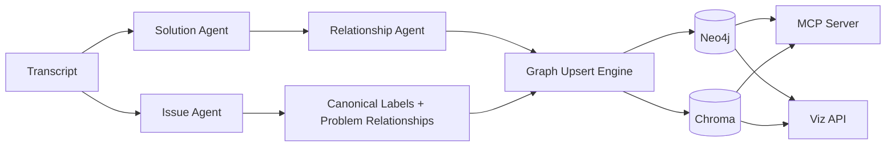

# Orange Memory Fabric

Orange is a chat-centric memory fabric for debugging and technical conversations. It turns transcripts into structured problem and solution memory, writes that memory into a graph plus vector store, exposes it through MCP tools, and makes the whole system inspectable through a visualization API.

## What It Does

- Extracts `Problem` and `Solution` nodes from raw transcripts
- Links solution attempts to the problems they address
- Tracks follow-up attempts and refinement chains across solutions
- Stores graph memory in Neo4j and semantic retrieval memory in Chroma
- Exposes retrieval and inspection tools through an MCP server
- Ships a local visualization API for graph and vector inspection
- Includes Streamlit and Slack entry points for interactive use

## Architecture



## Core Components

### Extraction Pipeline
- `core/agents/solution_agent/` parses solution attempts, outcomes, summaries, and refinement relationships.
- `core/agents/issue_agent/` segments problems, extracts technical context, builds canonical labels, and stitches problem relationships.
- `core/agents/orchestrator.py` runs the end-to-end extraction pipeline.

### Persistence Layer
- `core/graph_upsert/writer.py` writes session, problem, and solution nodes plus edges into Neo4j.
- `core/graph_upsert/dedup.py` manages the shared Chroma collection and embedding setup.
- `core/graph_schema_v2.py` defines the current graph-facing data model.

### Query + Inspection Layer
- `core/mcp_server/server.py` exposes MCP tools such as `ping_context`, `store_session`, `inspect_graph`, `get_node`, and `chroma_peek`.
- `core/mcp_server/handlers.py` contains the tool handlers and type-aware retrieval logic.
- `core/graph_queries/neo4j_queries.py` centralizes reusable Neo4j read queries shared by MCP and the viz API.

### Visualization Layer
- `core/viz_api/main.py` starts a FastAPI app for graph and Chroma inspection.
- `core/viz_api/routes/graph.py` serves graph-oriented endpoints.
- `core/viz_api/routes/chroma.py` serves vector-store inspection endpoints.
- `core/viz_api/routes/health.py` verifies Neo4j and Chroma connectivity.

### Interfaces
- `streamlit_app.py` is the local debugging UI.
- `core/slack_bot.py` is the Slack integration entry point.

## Repository Layout

```text
.
├── core/
│   ├── agents/
│   ├── graph_queries/
│   ├── graph_upsert/
│   ├── mcp_server/
│   ├── memory_extraction/
│   └── viz_api/
├── scripts/
│   └── test_pipeline.py
├── tests/
├── streamlit_app.py
└── requirements.txt
```

## Quick Start

### 1. Create a virtual environment

```bash
python3.11 -m venv venv311
source venv311/bin/activate
```

### 2. Install dependencies

```bash
pip install -r requirements.txt
```

This installs `mem0ai` from PyPI rather than relying on a vendored local checkout.

### 3. Configure environment

```bash
cp .env.example .env
```

Fill in the values you need. At minimum, configure:

- `OPENAI_API_KEY`
- Neo4j connection settings (`MEMGRAPH_URL` or `MEMGRAPH_HOST` + auth)
- Optional `CHROMA_PATH` if you do not want the default local path

## Running the System

### Run the local test pipeline

```bash
PYTHONPATH=. python scripts/test_pipeline.py
```

This exercises:
- Solution extraction
- Issue extraction
- Graph upsert
- Chroma embedding creation

### Start the visualization API

```bash
PYTHONPATH=. uvicorn core.viz_api.main:app --reload --port 8001
```

Useful endpoints:

- `GET /health`
- `GET /graph/full`
- `GET /graph/sessions`
- `GET /graph/problems`
- `GET /chroma/status`
- `GET /chroma/peek?limit=5`

### Start the MCP server

```bash
PYTHONPATH=. python -m core.mcp_server.server
```

This runs the Orange MCP server in stdio mode for tools-based clients.

### Launch Streamlit

```bash
streamlit run streamlit_app.py
```

## MCP Tools

The MCP server currently exposes tools for:

- `ping_context`
- `store_session`
- `resolve_problem`
- `inspect_graph`
- `get_node`
- `get_session_graph`
- `list_sessions`
- `chroma_peek`

## Testing

```bash
python -m py_compile core/**/*.py scripts/test_pipeline.py
pytest
```

## Security Notes

- This repository is intended to be pushed without secrets.
- `.env`, local databases, vector stores, Claude config, and generated inspection exports are gitignored.
- Use `.env.example` as the template for local configuration.
- Before pushing, do one last pass with a secret scan over tracked files.

## Roadmap-Friendly Areas

- Better session-level metadata and summarization
- Stronger problem deduplication and merge reporting
- Frontend graph explorer on top of the viz API
- Broader Slack and MCP workflows for memory inspection
